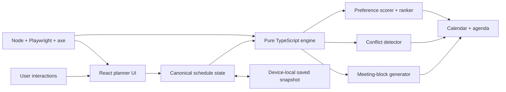

# CourseFlow

[](https://github.com/pharzy1/courseflow/actions/workflows/ci.yml)
[](https://berkeley-courseflow.zesty-mole-4007.chatgpt.site)
[](https://www.typescriptlang.org/)

CourseFlow is a preference-aware Berkeley schedule-planning prototype. It searches a transparent sample catalog, derives every displayed metric from one schedule state, ranks two meeting-time variants, detects overlaps, explains its score, and persists the plan on the current device.

> This repository intentionally demonstrates a production-minded frontend and deterministic scheduling engine. Course and enrollment values are illustrative; it does not claim live Berkeley data, cloud accounts, or a degree audit.

## Live product

**[Launch CourseFlow →](https://berkeley-courseflow.zesty-mole-4007.chatgpt.site)**


## Why this project is different

- **One canonical state:** selected courses drive units, blocks, conflicts, averages, scoring, roadmap totals, saving, and restoration.
- **Explainable ranking:** the headline score and visible contribution breakdown come from the same `ScoreResult` object.
- **Preference-sensitive alternatives:** morning, lunch, and instructor priorities can rank Schedule A and B differently.
- **Demonstrable conflict handling:** INFO 159 intentionally overlaps STAT 134 in Schedule A; Schedule B resolves it.
- **Accessible interaction:** labeled calendar events, a semantic agenda, live announcements, keyboard focus, responsive navigation, and automated axe checks.
- **Regression evidence:** unit tests validate the engine; Playwright covers real user flows on desktop and mobile; GitHub Actions runs the complete suite.

## Architecture



The engine in [`lib/courseflow.ts`](lib/courseflow.ts) has no React or browser dependency, making its behavior deterministic and inexpensive to test. See [`docs/ARCHITECTURE.md`](docs/ARCHITECTURE.md) for data flow, invariants, scoring, and extension boundaries.

## Test strategy

| Layer | What it proves | Command |
|---|---|---|
| Unit | Search aliases, filters, score reconciliation, preference ranking, conflict penalties, empty schedules | `pnpm test:unit` |
| Build | TypeScript and production bundling | `pnpm build` |
| End-to-end | Search → select → rank → save → reload, plus conflict resolution | `pnpm test:e2e` |
| Accessibility | Automated WCAG A/AA checks with axe on desktop and mobile | `pnpm test:accessibility` |
| Complete CI | Unit + build + browser suite | `pnpm test:ci` |

## Run locally

Requirements: Node.js 22+ and pnpm.

```bash
pnpm install
pnpm exec playwright install chromium
pnpm dev
```

Open `http://localhost:3000`.

## Key scenarios to inspect

1. Search for `CS 61B`, `machine learning`, or a nonsense query.
2. Toggle instructor, lunch, and morning priorities; inspect the reconciled score breakdown.
3. Add **INFO 159** while **STAT 134** is selected to trigger the conflict fixture.
4. Rank A vs. B to see the engine choose the higher-scoring alternative.
5. Save, make unsaved changes, restore, and reload.
6. Navigate entirely by keyboard or open **All schedule meetings** for the semantic alternative.

## Technology

- React 19 + TypeScript
- vinext/Vite deployment build
- Node test runner + tsx
- Playwright + axe-core
- GitHub Actions
- Sites deployment

## Current scope and next boundary

CourseFlow currently persists an anonymous snapshot in `localStorage`. The clean next boundary is an authenticated API adapter that replaces local storage without changing the scheduling engine. Live course ingestion, cloud persistence, notifications, and degree-audit integration are deliberately outside this release.

## Résumé-ready summary

> Built a TypeScript course-scheduling engine and responsive React interface that ranks meeting-time alternatives from user preferences, detects timetable conflicts, explains score contributions, persists user plans, and is regression-tested with Node, Playwright, axe, and GitHub Actions.

## License

MIT. CourseFlow is an independent student project and is not affiliated with UC Berkeley.

