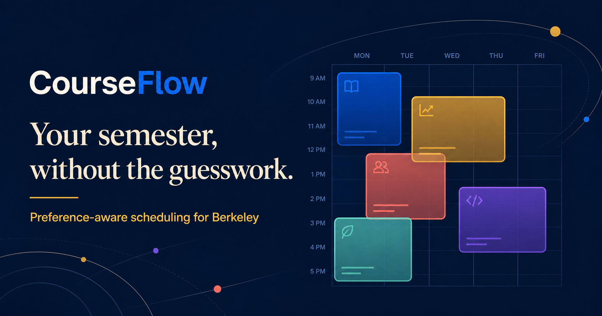
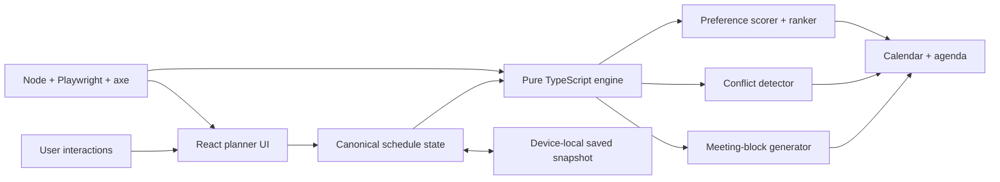

# CourseFlow

[](https://github.com/pharzy1/courseflow/actions/workflows/ci.yml)
[](https://berkeley-courseflow.zesty-mole-4007.chatgpt.site)
[](https://www.typescriptlang.org/)

CourseFlow is a unified Berkeley course-intelligence and schedule-planning prototype. It connects discovery, historical signals, prerequisites, course comparison, degree value, workload planning, and conflict-free schedule ranking in one explainable workflow.

Stage 2 of the real-data architecture is implemented: `/catalog` exposes thousands of Fall 2026 sections through a typed repository/API boundary, the resilient importer refreshes catalog and enrollment history in Neon Postgres every 15 minutes, and Clerk-aware accounts persist plans across devices. Every imported record includes visible provenance and the catalog reports its feed freshness truthfully.

> The planner demonstration still uses a small curated scheduling fixture; the separate real catalog is a dated, non-official BerkeleyTime snapshot. CourseFlow does not claim CalCentral integration or a degree audit.

## Live product

**[Launch CourseFlow →](https://berkeley-courseflow.zesty-mole-4007.chatgpt.site)**



## Why this project is different

- **One canonical state:** selected courses drive units, blocks, conflicts, averages, scoring, roadmap totals, local fallback, and authenticated cloud restoration.
- **Complete catalog adapter:** the Fall 2026 catalog uses bounded API pagination, retries and timeouts, department facets, enrollment filters, record-level provenance, and an observable freshness state.
- **Production persistence boundary:** Neon stores users, plans, sections, grades, and enrollment observations; Clerk identity is verified on the server before any plan read or write.
- **Cross-device plan library:** authenticated students can create, restore, duplicate, rename, and delete up to 20 named plans, with automatic device-plan migration and ownership-scoped mutations.
- **Unified course intelligence:** illustrative grade, workload, enrollment-momentum, prerequisite, and requirement signals live beside scheduling decisions.
- **Decision Desk:** compare up to three courses without bouncing between catalog, grades, enrollment, and planning tools.
- **Explainable ranking:** the headline score and visible contribution breakdown come from the same `ScoreResult` object.
- **Preference-sensitive alternatives:** morning, lunch, and instructor priorities can rank Schedule A and B differently.
- **Demonstrable conflict handling:** INFO 159 intentionally overlaps STAT 134 in Schedule A; Schedule B resolves it.
- **Accessible interaction:** labeled calendar events, a semantic agenda, live announcements, keyboard focus, responsive navigation, and automated axe checks.
- **Regression evidence:** unit tests validate the engine; Playwright covers real user flows on desktop and mobile; GitHub Actions runs the complete suite.

## Architecture



The engine in [`lib/courseflow.ts`](lib/courseflow.ts) has no React or browser dependency, making its behavior deterministic and inexpensive to test. See [`docs/ARCHITECTURE.md`](docs/ARCHITECTURE.md) for data flow, invariants, scoring, and extension boundaries.

## Test strategy

| Layer | What it proves | Command |
|---|---|---|
| Unit | Search, score reconciliation, feasibility, all course subsets, and course-intelligence calculations | `pnpm test:unit` |
| Integration | Complete snapshot count, provenance, facets, filters, and bounded pagination | `pnpm test:integration` |
| Build | TypeScript and production bundling | `pnpm build` |
| End-to-end | Search → select → rank → save → reload, plus conflict resolution | `pnpm test:e2e` |
| Accessibility | Automated WCAG A/AA checks with axe on desktop and mobile | `pnpm test:accessibility` |
| Complete CI | Unit + build + browser suite | `pnpm test:ci` |

## Run locally

Requirements: Node.js 22+ and pnpm.

```bash
pnpm install
pnpm exec playwright install chromium
pnpm dev
```

Open `http://localhost:3000`.

## Key scenarios to inspect

1. Search for `CS 61B`, `machine learning`, or a nonsense query.
2. Toggle instructor, lunch, and morning priorities; inspect the reconciled score breakdown.
3. Add **INFO 159** while **STAT 134** is selected to trigger the conflict fixture.
4. Rank A vs. B to see the engine choose the higher-scoring alternative.
5. Save, make unsaved changes, restore, and reload.
6. Open **Intelligence**, switch courses, inspect prerequisite paths, and compare up to three choices.
7. Navigate entirely by keyboard or open **All schedule meetings** for the semantic alternative.

## Technology

- React 19 + TypeScript
- vinext/Vite deployment build
- Node test runner + tsx
- Playwright + axe-core
- GitHub Actions
- Sites deployment

## Runtime modes

- `COURSEFLOW_DATA_MODE=snapshot` serves the complete versioned catalog bundled with a release.
- `COURSEFLOW_DATA_MODE=neon` serves the same API contract from Neon.
- Clerk keys activate sign-in and the cross-device plan library; without them, anonymous local saving continues safely.
- The 15-minute scheduler calls a secret-protected production worker that paginates the entire source, upserts Neon, records immutable enrollment observations, and exposes the last successful retrieval time.

Production Clerk and Neon are activated. See [`docs/DATA_SOURCES.md`](docs/DATA_SOURCES.md) for the source contract, provenance policy, and operational limits.

## Résumé-ready summary

> Built a TypeScript course-intelligence and scheduling platform with a 5,928-section canonical data pipeline (normalized from 6,085 source listings), Neon serverless persistence, Clerk-authenticated cross-device plans, explainable conflict-free ranking, and responsive WCAG-tested React workflows.

## License

MIT. CourseFlow is an independent student project and is not affiliated with UC Berkeley.
