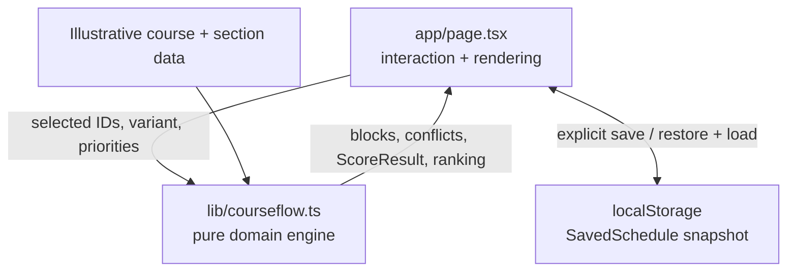
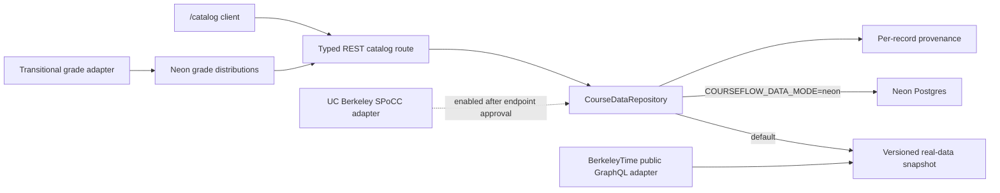
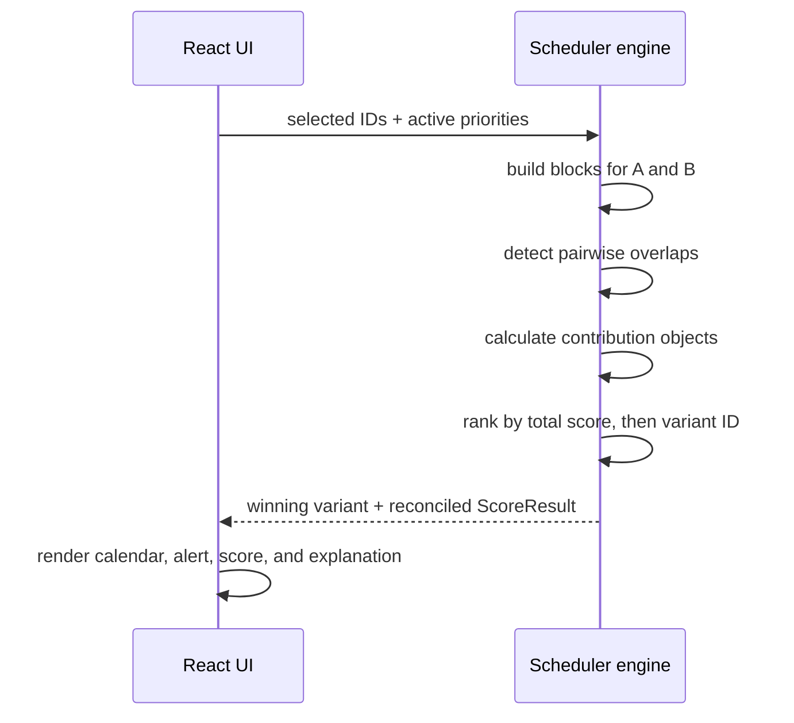

# CourseFlow architecture

## Design goals

1. Keep product claims observable and testable.
2. Derive every schedule metric from one selected-course state.
3. Keep scheduling logic independent of rendering and storage.
4. Make score explanations structurally incapable of drifting from headline scores.
5. Preserve an upgrade path from local persistence to an API-backed account model.

## Runtime topology



## Feature-flagged real-data topology



The UI depends only on `CourseDataRepository`. The default snapshot is deterministic and anonymous-safe; production can switch to Neon with `DATABASE_URL` and `COURSEFLOW_DATA_MODE=neon`. Auth is a separate optional boundary so missing Clerk keys cannot block public catalog reads.

The Postgres model covers sources, courses, sections, grade distributions, enrollment snapshots, user profiles, and saved plans. Historical grades use the existing `grade_distributions` table, so all-time and filtered cohorts share one auditable storage contract. The grade-source interface is deliberately replaceable; the current BerkeleyTime implementation is transitional and explicitly non-official.

## Domain model

- `Course` describes catalog metadata and the stable course identifier.
- `Course` also owns the illustrative intelligence inputs: grade median, workload, demand history, prerequisites, and requirements.
- `Block` is one meeting on one weekday with a normalized start and duration.
- `Priority` is a closed union: `morning | lunch | rating`.
- `Variant` is currently `0 | 1`, representing two deterministic section combinations.
- `ScoreResult` contains the headline score and every contribution used to produce it.
- `SavedSchedule` is a versionable browser snapshot of selected IDs, priorities, variant, and timestamp.

## Engine pipeline



## Scoring contract

The unbounded score is the exact sum of:

```text
base feasibility
+ instructor contribution, only when rating is active
+ free-morning contribution, only when morning is active
+ protected-lunch contribution, only when lunch is active
- 15 points per detected overlap
```

The result is clamped to 0–100. The UI renders values directly from `ScoreResult.contributions`; it does not recompute presentation-only numbers.

## Conflict fixture

INFO 159 and STAT 134 meet Tuesday/Thursday at 9:30–11:00 in Schedule A. Selecting both produces two conflict pairs and a 30-point penalty. Schedule B moves INFO 159 to 3:00–4:30 PM, after DATA C100, so the normal five-course path resolves every overlap. Ranking treats feasibility as a gate: only a zero-conflict candidate can be announced as the winner.

## State invariants

- `selected` stores IDs only; course objects are derived from the catalog.
- Units are the sum of currently selected course units.
- Calendar blocks are generated from the same selected IDs and active variant.
- Conflict count is derived from displayed blocks.
- Score and explanation share one engine result.
- The roadmap current term reads the same count and unit values.
- Save and restore serialize the same state required to reproduce the schedule.
- Course comparison is derived from stable course IDs and cannot mutate schedule state.
- `courseSignal` is the single calculation used by cards, the intelligence workspace, and comparisons.

## Test boundaries

- `tests/unit/courseflow.test.ts` verifies domain and intelligence invariants without a browser.
- `tests/e2e/courseflow.spec.ts` verifies the schedule and course-intelligence workflows at desktop, tablet, and mobile sizes plus WCAG rules.
- `.github/workflows/ci.yml` makes both suites a repeatable merge/push check.
- `tests/integration/data-layer.test.ts` verifies the real snapshot contract and provenance independently of the UI.
- `.github/workflows/data-refresh.yml` performs a daily read-only refresh validation; database mutation remains disabled until credentials and reuse terms are configured.

## Evolution path

The UI should depend on a future `ScheduleRepository` interface rather than calling `localStorage` directly. A backend implementation can provide authentication and PostgreSQL persistence while leaving `lib/courseflow.ts` unchanged. A data-ingestion adapter can replace the illustrative constants after licensing, provenance, freshness, and failure states are defined.
